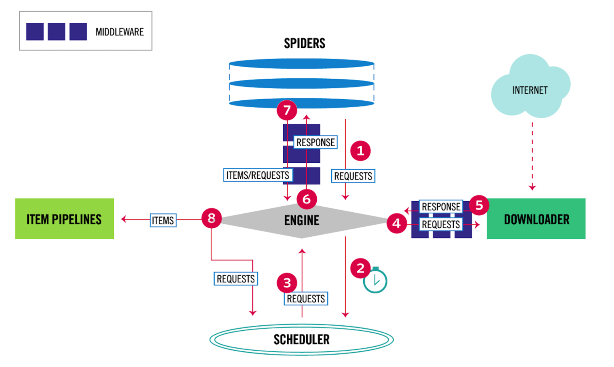

# Scrapy
#爬虫/Scrapy

```python
mysql 安装

配置外地访问
-> vim /etc/mysql/mysql.conf.d/mysqld.cnf
    -> bind-address = 0.0.0.0
    -> datadir = 数据文件目录
-> 授权 
    mysql-> FRANT ALL PRIBILEGES ON *.* TO 'ROOT'@'%（所有ip）' IDENTIFIED BY '密码' with grant option;
    mysql-> flush privileges;
    
sudo service mysql restart

安装Python 

安装Python版本管理工具

pip install -i https://pypi.douban.com/simple scrapy
```
[Ubuntu设置MySQL允许远程访问 - wzwyc - 博客园](https://www.cnblogs.com/wzwyc/p/10121409.html)




```python
import sys

print(sys.argv)
```

```
[‘/Library/Frameworks/Python.framework/Versions/3.8/lib/python3.8/site-packages/ipykernel_launcher.py', '-f', '/Users/mac/Library/Jupyter/runtime/kernel-6bbe7b8d-99b9-4cf0-adcf-fdee71879288.json']
```

# Scrapy内置 selector
::from scrapy import Selector:: 
::response = Selector(text=html)::

```
基于 twisted,性能是最大的优势
内置CSS和Xpath selector 非常方便
```

## 网页分类
* 静态网页
* 动态网页
* webservice(restapi)

## 做什么

* 搜索引擎 （垂直领域搜索引擎）
* 推荐引擎  今日头条
* 机器学习的数据样本
* 数据分析、舆情分析等

## 爬虫去重策略

1. 存到数据库
2. set 存到内存中
3. url 经过 md5 等方法 哈希后保存到内存
4. 用bitmap 方式，将访问的url经过hash函数映射到某一位
5. bloonmfilter 方式 对 bitmap进行改进 ，多重hash 函数降低冲突

## 字符串编码
image.png

```python

import sys

print(sys.getfilesystemencoding)


s = 'abc'
su = u'abc'

s.encode("utf8")
# decode 将字符串转换成 Unicode python3 为 Unicode
# su.decode("utf8").encode('utf8')
```

```
<built-in function getfilesystemencoding>
```

```
b'abc'
```

## 步骤

* 明确网站
* URL
* 爬取数据

## Cookies

- - - -

image.png

# SessionID
无状态请求 -> cookie -> 有状态请求  (本地)
cookie 不安全 ->  sessionID (服务器生成，有一定的生存时间， 发送到本地， 方便有状态登录)

## http状态码

- - - -

image.png

```python
import requests
from bs4 import BeautifulSoup
from selenium import webdriver

class Douban:
    def __init__(self):
        self.URL = 'http://www.dianping.com/shop/69039364/review_all/p'
        self.header = {
               'User-Agent': 'Mozilla/5.0 (Windows NT 5.1; U; en; rv:1.8.1) Gecko/20061208 Firefox/2.0.0 Opera 9.50'
        }
        self.browser = webdriver.Chrome()
        
    def get_top250(self):
            html = """你要爬取网页的源码（贴过来）"""
            self.browser.get(self.URL)
            soup = BeautifulSoup(html.text,"html.parser")
            #name = soup.select('//*[@id="review-list"]/di v[2]/div[3]/div[3]/div[3]/ul[表情][2]/div/div[2]/span[2]/span[1]/text()')
            #username=soup.find_all(class_="name")
            print(html)

if __name__== "__main__":
    cls = Douban()
    cls.get_top250()
```


```
AttributeError: 'str' object has no attribute 'text'
```

```python
import requests
header = {
               'User-Agent': 'Mozilla/5.0 (Windows NT 5.1; U; en; rv:1.8.1) Gecko/20061208 Firefox/2.0.0 Opera 9.50'
        }
print()
import http.cookierjar as cookielib

def get_xsrf():
    # 500 
    response = requests.get('https://www.zhihu.com/', headers = header).text
    
        
def zhiHu_login (account, passwd):
    try:
        if re.match('^1\d+{10}',account):
            print('手机号')
            


```

